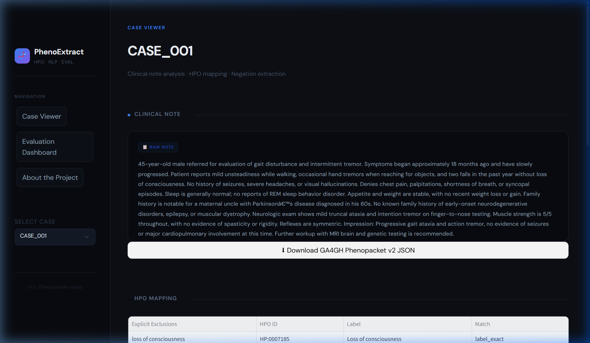
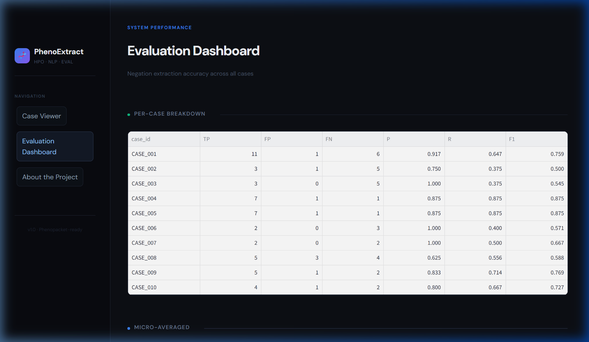
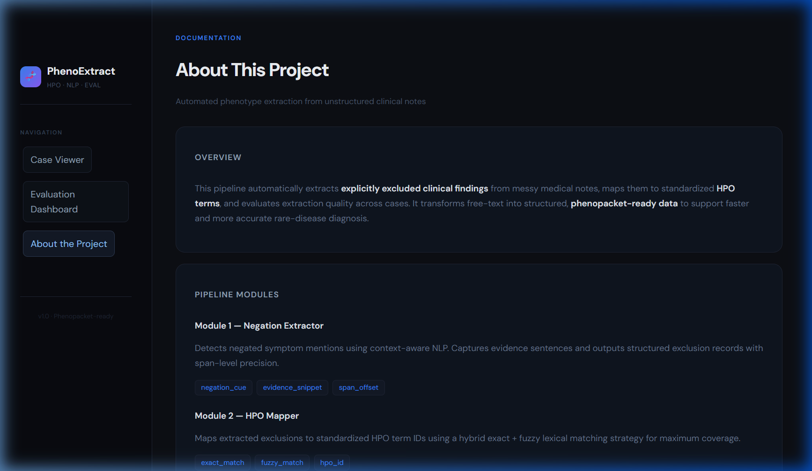

# 🧬 PhenoExtract — Clinical Phenotype Extraction Pipeline

A modular NLP pipeline that extracts **negated clinical findings** from unstructured medical notes, maps them to **Human Phenotype Ontology (HPO)** terms, and evaluates extraction accuracy — all visualized in an interactive **Streamlit dashboard**.

---

## 📸 Dashboard Preview

### Case Viewer
Browse individual clinical notes, view extracted exclusions with HPO mappings, and export structured data as **GA4GH Phenopackets** or **HL7 FHIR bundles**.



### Evaluation Dashboard
Micro/Macro F1, Precision, and Recall scores with interactive charts — per-case breakdown, scatter plots, and grouped bar comparisons.



### About
Overview of the pipeline architecture and module responsibilities.



---

## 🔬 How It Works

```
Clinical Note  →  Module B (Negation Extraction)  →  Module A (HPO Mapping)  →  Module C (Evaluation)  →  Dashboard
```

| Module | Role | Key Tech |
|--------|------|----------|
| **Module B** | Detects negated findings (e.g. *"no seizures"*) using context-aware NLP | spaCy, negspacy |
| **Module A** | Maps extracted mentions to HPO term IDs via exact + fuzzy matching | `hp.obo` ontology |
| **Module C** | Computes Micro/Macro F1 against gold annotations | Precision, Recall, F1 |
| **Dashboard** | Interactive visualization of all results | Streamlit, Altair |

---

## 📁 Project Structure

```
project/
├── streamlit_app.py          # Main dashboard application
├── modules/
│   ├── Module_A.ipynb        # HPO mapping notebook
│   ├── Module_B.ipynb        # Negation extraction notebook
│   └── Evaluation.ipynb      # Evaluation notebook
├── data/
│   ├── gold.json             # Gold-standard annotations
│   ├── moduleA_output.json   # Module A output
│   ├── moduleB_output.json   # Module B output
│   └── A_dummy.json          # Dummy input data
├── resources/
│   └── clinical_notes/       # Raw clinical note text files
└── docs/
    └── screenshots/          # Dashboard screenshots for README
```

---

## 🚀 Getting Started

### Prerequisites
- Python 3.9+

### Installation

```bash
# Clone the repository
git clone https://github.com/<your-username>/HackRear.git
cd HackRear

# Create a virtual environment
python -m venv .venv

# Activate the virtual environment
# Windows:
.venv\Scripts\activate
# macOS/Linux:
source .venv/bin/activate

# Install dependencies
pip install -r requirements.txt
```

### Run the Dashboard

```bash
streamlit run streamlit_app.py
```

The app will open at **http://localhost:8501**.

---

## 📊 Evaluation Metrics

| Metric | Description |
|--------|-------------|
| **Micro F1** | Overall performance across all mentions combined |
| **Macro F1** | Average per-case performance |
| **Precision** | TP / (TP + FP) — how many extractions were correct |
| **Recall** | TP / (TP + FN) — how many gold mentions were found |

---

## 📦 Export Formats

The dashboard supports exporting structured data in two clinical standards:

- **GA4GH Phenopacket v2** — interoperable phenotype exchange format for rare disease
- **HL7 FHIR R4 Bundle** — healthcare-standard observation resources

---

## 🛠️ Built With

- [Streamlit](https://streamlit.io/) — Dashboard framework
- [spaCy](https://spacy.io/) + [negspacy](https://github.com/jenojp/negspacy) — NLP & negation detection
- [Altair](https://altair-viz.github.io/) — Interactive visualizations
- [Human Phenotype Ontology](https://hpo.jax.org/) — Standardized phenotype vocabulary
